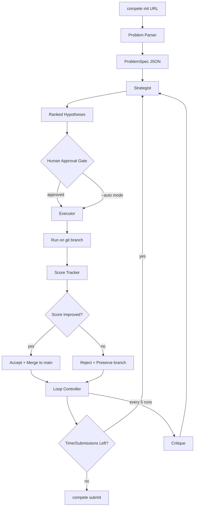

# feat: Competition Agent Full Implementation

## Overview

Build a CLI agent framework (`compete`) that turns Claude Code into a persistent optimization loop for winning hackathons, Kaggle competitions, Jane Street puzzles, and similar scored challenges. The system iterates toward the best score under time and submission constraints through a Parse -> Classify -> Hypothesize -> Execute -> Score -> Accept/Reject -> Repeat loop.

Five core modules: Problem Parser, Strategist, Executor, Score Tracker, and Loop Controller. Built in Python with UV, SQLite for persistence, and Git for version control (one branch per hypothesis).

## Problem Statement / Motivation

Competitions reward iterative optimization under constraints -- not one-shot solutions. Current AI coding assistants solve problems but don't *optimize scores over time*. This framework adds the missing outer loop: persistent memory (SQLite + git), time-budget-aware strategy selection, hypothesis-driven experimentation, and automatic accept/reject decisions.

## Proposed Solution

Six implementation sprints building bottom-up: scaffold and core types first, then executor, parser, strategist, controller, and finally playbooks + polish. Each sprint produces testable artifacts.

### Architecture

```
┌─────────────────────────────────────────────────────┐
│                    CLI Entry Point                   │
│              compete <command> [options]             │
└──────────────┬──────────────────────────────────────┘
               │
    ┌──────────▼──────────┐
    │    Problem Parser   │  ← Ingests specs, datasets, rules
    └──────────┬──────────┘
               │ ProblemSpec
    ┌──────────▼──────────┐
    │     Strategist      │  ← LLM-powered hypothesis generation
    │  (priority queue)   │     + problem classification
    └──────────┬──────────┘
               │ Hypothesis
    ┌──────────▼──────────┐
    │      Executor       │  ← Writes code, runs it, captures output
    │  (sandboxed env)    │
    └──────────┬──────────┘
               │ Result
    ┌──────────▼──────────┐
    │    Score Tracker     │  ← Lab notebook: every run logged
    │  (sqlite + markdown) │
    └──────────┬──────────┘
               │ ScoreHistory
    ┌──────────▼──────────┐
    │   Loop Controller   │  ← Time-budget-aware meta-policy
    │  (accept/reject +   │     decides: iterate, pivot, or ship
    │   strategy select)  │
    └─────────────────────┘
```

### Data Flow Diagram



## Technical Approach

### Core Data Types (`comp_agent/models/`)

All shared types live in a single `models/` package so every module agrees on the contracts.

#### `comp_agent/models/spec.py` -- ProblemSpec

```python
from dataclasses import dataclass, field, asdict
from datetime import datetime
import json

@dataclass
class ProblemSpec:
    # Identity
    name: str
    source: str  # "kaggle" | "hackathon" | "puzzle" | "custom"
    url: str | None = None

    # Objective
    problem_type: str = "classification"
    objective_description: str = ""
    metric: str = "accuracy"
    metric_direction: str = "maximize"  # "minimize" | "maximize"

    # Constraints
    time_limit: datetime | None = None
    submission_limit: int | None = None
    compute_constraints: str | None = None
    rules: list[str] = field(default_factory=list)

    # Data
    data_paths: list[str] = field(default_factory=list)
    data_description: str = ""
    target_column: str | None = None
    submission_format: str = ""

    # Evaluation
    eval_script: str | None = None
    public_leaderboard: bool = False

    def to_json(self, path: str) -> None:
        with open(path, "w") as f:
            json.dump(asdict(self), f, indent=2, default=str)

    @classmethod
    def from_json(cls, path: str) -> "ProblemSpec":
        with open(path) as f:
            return cls(**json.load(f))
```

#### `comp_agent/models/hypothesis.py` -- Hypothesis

```python
@dataclass
class Hypothesis:
    id: str
    description: str
    rationale: str
    expected_improvement: float
    estimated_time_minutes: int
    risk: str  # "low" | "medium" | "high"
    dependencies: list[str] = field(default_factory=list)
    strategy_phase: str = "improve"
    code_sketch: str = ""
```

#### `comp_agent/models/result.py` -- Result (NEW -- identified as missing in spec)

```python
@dataclass
class Result:
    id: str
    hypothesis_id: str
    branch: str
    score: float | None
    metric: str
    runtime_seconds: float
    memory_mb: float
    status: str  # "success" | "error" | "timeout"
    error_message: str | None = None
    code_diff: str = ""
    stdout: str = ""
    stderr: str = ""
    timestamp: datetime = field(default_factory=datetime.now)

    def score_improved(self, best_score: float | None, direction: str) -> bool:
        if self.status != "success" or self.score is None:
            return False
        if best_score is None:
            return True
        if direction == "maximize":
            return self.score > best_score
        return self.score < best_score
```

### Implementation Phases

#### Phase 1: Scaffold + Tracker (Sprint 1)

**Goal:** Project init, core types, SQLite tracker, markdown report generator.

**Tasks:**

- [ ] Initialize project with `uv init`, create `pyproject.toml` with dependencies (`click`, `pyyaml`)
- [ ] Create directory structure:
  ```
  comp_agent/
      __init__.py
      cli.py              # Click CLI entry point
      models/
          __init__.py
          spec.py          # ProblemSpec
          hypothesis.py    # Hypothesis
          result.py        # Result (NEW)
      parser/
      strategist/
      executor/
      tracker/
      controller/
  ```
- [ ] Implement `ProblemSpec`, `Hypothesis`, and `Result` dataclasses with JSON serialization in `comp_agent/models/`
- [ ] Create SQLite tracker in `comp_agent/tracker/db.py`:
  - `runs` table (matches schema from CLAUDE.md)
  - `hypotheses` table with status tracking
  - `submissions` table (NEW -- tracks submission count against daily limits)
  - `critiques` table (NEW -- stores critique output for feeding back into strategist)
  - Enable `PRAGMA foreign_keys = ON`
- [ ] Implement markdown report generator in `comp_agent/tracker/log.py`
- [ ] Implement score comparison logic in `comp_agent/tracker/compare.py`
- [ ] Create `config.yaml` schema definition:
  ```yaml
  time_budget_hours: 48
  submission_limit_per_day: 5
  reserved_submissions_per_day: 1  # held back for final validation
  execution_timeout_seconds: 1800  # 30 min default
  max_consecutive_failures: 5      # triggers stuck detection
  critique_interval: 5             # every N runs
  autonomy_mode: "approval"        # "approval" | "auto"
  ```
- [ ] Create `.gitignore`: `data/`, `*.db`, `__pycache__/`, `*.pyc`, `submissions/`, `solution/models/*.pkl`, `.venv/`
- [ ] **Test:** Insert fake runs and hypotheses, verify report renders correctly, verify score comparison works for both minimize and maximize directions

**Files:**
- `pyproject.toml`
- `comp_agent/__init__.py`
- `comp_agent/models/__init__.py`
- `comp_agent/models/spec.py`
- `comp_agent/models/hypothesis.py`
- `comp_agent/models/result.py`
- `comp_agent/tracker/__init__.py`
- `comp_agent/tracker/db.py`
- `comp_agent/tracker/log.py`
- `comp_agent/tracker/compare.py`
- `config.yaml`
- `.gitignore`
- `tests/test_tracker.py`

#### Phase 2: Executor (Sprint 2)

**Goal:** Git branch management, sandboxed code execution, output validation, snapshot commits.

**Tasks:**

- [ ] Implement git branch manager in `comp_agent/executor/snapshot.py`:
  - `create_branch(hypothesis_id)` -- branch from main
  - `commit_snapshot(hypothesis_id, message)` -- structured commit
  - `merge_to_main(branch)` -- with conflict detection
  - `rebase_onto_main(branch)` -- attempt rebase before merge, handle conflicts
  - If merge conflicts: attempt LLM-assisted resolution, else mark as "accepted-unmergeable"
- [ ] Implement code runner in `comp_agent/executor/runner.py`:
  - Subprocess execution with configurable timeout (from `config.yaml`)
  - Capture stdout, stderr, runtime, memory usage (via `resource` module)
  - Handle OOM and timeout gracefully -- catch, log, continue
  - Return `Result` dataclass
- [ ] Implement output validator in `comp_agent/executor/validate.py`:
  - Check submission file exists
  - Validate format against `ProblemSpec.submission_format`
  - Validate row count, column names, data types
- [ ] Implement hypothesis implementer in `comp_agent/executor/implement.py`:
  - Takes `Hypothesis` and produces code changes
  - Delegates actual code writing to Claude Code (prompt template)
  - Retry up to 3 times on execution errors
- [ ] **Test:** Run a trivial Python script on a branch, capture result, merge back to main. Test conflict detection with two branches modifying the same file.

**Files:**
- `comp_agent/executor/__init__.py`
- `comp_agent/executor/snapshot.py`
- `comp_agent/executor/runner.py`
- `comp_agent/executor/validate.py`
- `comp_agent/executor/implement.py`
- `tests/test_executor.py`

#### Phase 3: Parser (Sprint 3)

**Goal:** Turn competition URLs/specs into structured `ProblemSpec` objects.

**Tasks:**

- [ ] Implement Kaggle extractor in `comp_agent/parser/extractors/kaggle.py`:
  - Use Kaggle API (`kaggle` package) for metadata + data download
  - Extract metric, submission format, rules, deadline
  - Download data files to `data/`
- [ ] Implement generic web extractor in `comp_agent/parser/extractors/hackathon.py`:
  - Fetch page content via web fetch
  - Use Claude Code to extract ProblemSpec fields from unstructured HTML
  - Handle Devpost, generic hackathon pages
- [ ] Implement puzzle extractor in `comp_agent/parser/extractors/puzzle.py`:
  - Handle Jane Street puzzles, math competitions
  - Extract problem statement, constraints, evaluation criteria
- [ ] Implement custom spec loader in `comp_agent/parser/extractors/custom.py`:
  - Load from user-provided YAML file
  - Validate all required fields present
- [ ] Implement parser entry point in `comp_agent/parser/parse.py`:
  - Auto-detect source type from URL or file path
  - Route to appropriate extractor
  - Output `ProblemSpec` JSON to `problem_spec.json`
  - List assumptions when spec fields are ambiguous
- [ ] **Test:** Parse a real closed Kaggle competition end-to-end

**Files:**
- `comp_agent/parser/__init__.py`
- `comp_agent/parser/parse.py`
- `comp_agent/parser/extractors/__init__.py`
- `comp_agent/parser/extractors/kaggle.py`
- `comp_agent/parser/extractors/hackathon.py`
- `comp_agent/parser/extractors/puzzle.py`
- `comp_agent/parser/extractors/custom.py`
- `tests/test_parser.py`

#### Phase 4: Strategist (Sprint 4)

**Goal:** LLM-powered hypothesis generation, problem classification, critique, and playbook loading.

**Tasks:**

- [ ] Implement problem classifier in `comp_agent/strategist/classify.py`:
  - ProblemSpec -> problem type + strategy family
  - Map to one of: tabular_ml, cv, nlp, combinatorial, math_puzzle, systems
  - Output initial strategy recommendations based on taxonomy
- [ ] Implement hypothesis generator in `comp_agent/strategist/hypothesize.py`:
  - Prompt templates conditioned on: problem type, strategy phase, score history, recent critiques
  - Generate 3-5 concrete hypotheses with code sketches
  - Enforce specificity: "compute rolling 7-day mean of column X" not "try feature engineering"
  - Include recent critique findings in the generation prompt (closing the feedback loop)
- [ ] Implement prioritizer in `comp_agent/strategist/prioritize.py`:
  - Rank hypotheses by `expected_improvement / estimated_time_minutes`
  - Factor in risk level and remaining time budget
  - Deprioritize hypotheses similar to recently-rejected ones
- [ ] Implement critique module in `comp_agent/strategist/critique.py`:
  - Adversarial review of current best solution
  - "Act as a competition grandmaster" prompt
  - Output stored in `critiques` table, fed into next hypothesis generation
- [ ] Create playbook markdown files in `comp_agent/strategist/playbooks/`:
  - `tabular_ml.md` -- EDA, feature eng, XGBoost baseline, stacking, ensembles
  - `cv.md` -- pretrained models, augmentation, TTA, pseudo-labeling
  - `nlp.md` -- fine-tuning, prompt engineering, data augmentation
  - `combinatorial.md` -- greedy/DP, local search, simulated annealing
  - `math_puzzle.md` -- brute force, pattern recognition, proof strategies
  - `systems.md` -- MVP, feature completeness, demo prep
- [ ] Implement playbook loader that injects relevant playbook into prompts
- [ ] **Test:** Generate hypotheses for a real Kaggle competition given a ProblemSpec and empty history

**Files:**
- `comp_agent/strategist/__init__.py`
- `comp_agent/strategist/classify.py`
- `comp_agent/strategist/hypothesize.py`
- `comp_agent/strategist/prioritize.py`
- `comp_agent/strategist/critique.py`
- `comp_agent/strategist/playbooks/tabular_ml.md`
- `comp_agent/strategist/playbooks/cv.md`
- `comp_agent/strategist/playbooks/nlp.md`
- `comp_agent/strategist/playbooks/combinatorial.md`
- `comp_agent/strategist/playbooks/math_puzzle.md`
- `comp_agent/strategist/playbooks/systems.md`
- `tests/test_strategist.py`

#### Phase 5: Controller + Loop + CLI (Sprint 5)

**Goal:** Time-budget-aware meta-policy, main optimization loop, CLI entry point.

**Tasks:**

- [ ] Implement time budget tracker in `comp_agent/controller/budget.py`:
  - Track remaining hours from `ProblemSpec.time_limit` or `config.yaml`
  - Estimate time per hypothesis based on historical averages
  - Track submission count against daily limit with reserved-submission policy
- [ ] Implement phase selection policy in `comp_agent/controller/policy.py`:
  - State machine: `INIT -> PARSE -> BASELINE -> IMPROVE -> ENSEMBLE -> POLISH -> SUBMIT`
  - Time-based transitions (>24h improve, >6h ensemble, >2h polish, <2h submit)
  - Improvement rate calculation with configurable window
  - **Pivot handling:** when improvement stalls, switch strategy family or reset approach
  - **Stuck detection:** after N consecutive failures, escalate to human with "what should we try differently?"
- [ ] Implement main loop in `comp_agent/controller/loop.py`:
  - Wire all modules together
  - Structured error handling per failure class:
    - LLM API error: retry with exponential backoff (max 3 retries)
    - Execution timeout: reject hypothesis, log, continue
    - Git error: attempt recovery, halt if unrecoverable
    - Disk full: halt immediately with clear message
  - Periodic critique every N runs (configurable)
  - Feed critique results into next hypothesis generation cycle
  - Support both approval-gated and autonomous modes
- [ ] Implement CLI in `comp_agent/cli.py` using Click:
  ```
  compete init <url-or-path> [--source kaggle|hackathon|puzzle|custom] [--time-budget 48h]
  compete run [--iterations 5] [--auto] [--phase baseline|improve|ensemble|polish]
  compete status [--verbose]
  compete submit [--validate-only]
  compete approve <hypothesis-id>  # for approval-gated mode
  compete history [--last N]
  ```
- [ ] Session resumption: every command reads `problem_spec.json` + tracker DB + git state to reconstruct context. No in-memory state persists between commands.
- [ ] **Test:** Run the full loop on a closed Kaggle competition for 3-5 iterations

**Files:**
- `comp_agent/controller/__init__.py`
- `comp_agent/controller/budget.py`
- `comp_agent/controller/policy.py`
- `comp_agent/controller/loop.py`
- `comp_agent/cli.py`
- `compete.py` (thin wrapper: `from comp_agent.cli import cli; cli()`)
- `tests/test_controller.py`
- `tests/test_cli.py`

#### Phase 6: Playbooks + Ensemble + Polish (Sprint 6)

**Goal:** Detailed playbooks, ensemble scaffolding, Kaggle submission helper, error recovery.

**Tasks:**

- [ ] Write detailed content for each playbook in `comp_agent/strategist/playbooks/`
- [ ] Implement ensemble builder in `comp_agent/executor/ensemble.py`:
  - **Prediction-merging approach** (not code-merging -- avoids git conflict hell):
    1. For each accepted branch, checkout and run `predict.py` to produce predictions
    2. Collect all prediction outputs in a standardized format
    3. Write `ensemble.py` on main that combines predictions (weighted average, voting, stacking)
    4. Tune ensemble weights via grid search or optimization
  - Require each accepted hypothesis to produce a `predict.py` with standard output format
- [ ] Implement Kaggle submission helper in `comp_agent/parser/extractors/kaggle.py`:
  - Upload submission via Kaggle API
  - Track submission count against daily limit
  - Record leaderboard score and compare to local CV score
  - Flag divergence beyond configurable threshold
- [ ] Add local evaluation proxy for competitions without eval scripts:
  - K-fold cross-validation with configurable K
  - Track local CV score alongside leaderboard score
  - Warn when local and leaderboard diverge
- [ ] Error recovery and graceful degradation:
  - Retry logic with exponential backoff for transient failures
  - Orphaned branch cleanup (detect branches with no corresponding tracker entry)
  - Database integrity checks on startup
- [ ] **Test:** End-to-end on 2-3 different competition types (tabular ML, combinatorial, puzzle)

**Files:**
- `comp_agent/executor/ensemble.py`
- `comp_agent/strategist/playbooks/*.md` (content updates)
- `tests/test_ensemble.py`
- `tests/test_e2e.py`

## Alternative Approaches Considered

**1. Code-merging ensembles vs. prediction-merging ensembles**

Code-merging (cherry-picking changes from multiple hypothesis branches into one codebase) is elegant in theory but fails in practice because most hypotheses modify the same files (`train.py`, feature pipelines) in incompatible ways. Merge conflicts are near-guaranteed by the 3rd accepted hypothesis.

**Chosen:** Prediction-merging. Each accepted branch produces predictions independently, and a new ensemble script combines the outputs. This avoids merge conflicts entirely and is how most Kaggle winners actually ensemble in practice.

**2. Fully autonomous loop vs. human-approval-gated loop**

A fully autonomous loop maximizes throughput but risks burning submission limits, going down dead-end paths for hours, or making irreversible mistakes (bad merges).

**Chosen:** Default to approval-gated mode with `--auto` flag for autonomous. The `compete run` command generates and ranks hypotheses; `compete approve <id>` executes one. Users can opt into autonomous mode as trust builds.

**3. LLM for code generation vs. template-based code generation**

Template-based is more predictable but limited to known patterns. LLM-based can handle novel situations but is less reliable.

**Chosen:** LLM-based via Claude Code for the executor (code writing), with playbook-guided prompts to keep it on track. The strategist is purely LLM. The tracker and controller are pure code with no LLM calls.

## System-Wide Impact

### Interaction Graph

```
compete init → Parser.parse() → ProblemSpec.to_json() → TrackerDB.init()
compete run  → Controller.select_phase() → Strategist.generate() → [approval gate]
             → Executor.create_branch() → Executor.implement() → Runner.run()
             → Validator.check() → TrackerDB.log_run()
             → Compare.score_improved() → [accept: merge | reject: preserve]
             → every 5th: Strategist.critique() → TrackerDB.log_critique()
             → Controller.check_budget() → [continue | transition phase | halt]
```

### Error & Failure Propagation

| Error Class | Source | Handling | Recovery |
|---|---|---|---|
| LLM API timeout | Strategist, Executor | Retry 3x with backoff | Fall back to previous hypothesis queue |
| Execution OOM | Runner | Catch via subprocess, log as "error" | Reject hypothesis, note memory constraint for strategist |
| Execution timeout | Runner | Kill process after configurable limit | Reject, log, continue |
| Git merge conflict | Snapshot | Attempt rebase, then LLM-assisted resolution | Mark "accepted-unmergeable" if unresolvable |
| Submission limit hit | Budget tracker | Block further submissions for the day | Continue local-only runs, queue submissions for tomorrow |
| Corrupt SQLite | TrackerDB | Integrity check on startup | Rebuild from git history if possible |
| Disk full | Runner, any write | Catch IOError, halt loop | Alert user, suggest cleanup |

### State Lifecycle Risks

- **Orphaned git branches:** If executor crashes between `create_branch` and `commit_snapshot`, a dirty branch remains. Mitigation: startup cleanup that detects branches with no tracker entry.
- **Inconsistent tracker state:** If hypothesis is logged but run fails to log, tracker shows a hypothesis in "running" state forever. Mitigation: timeout check on startup -- any hypothesis in "running" for >2x the execution timeout is marked "error".
- **Stale `report.md`:** If loop crashes between score logging and report refresh. Mitigation: regenerate report on every `compete status` call, not just after runs.

### API Surface Parity

The CLI is the only external interface. All commands reconstruct state from disk (SQLite + git + JSON), so there's no hidden in-memory state. Every operation a user can do via `compete` commands, an automated script can also do.

## Acceptance Criteria

### Functional Requirements

- [ ] `compete init <url>` creates a workspace with ProblemSpec, git repo, SQLite tracker, and config
- [ ] `compete init --source custom <path>` loads a user-provided YAML spec
- [ ] `compete run` generates ranked hypotheses and waits for approval (default mode)
- [ ] `compete run --auto --iterations 5` runs 5 autonomous iterations
- [ ] `compete approve <id>` executes a specific hypothesis
- [ ] `compete status` displays current score, run history, and pending hypotheses
- [ ] `compete submit` generates and validates the final submission file
- [ ] Each hypothesis executes on its own git branch
- [ ] Accepted hypotheses are merged to main; rejected branches are preserved
- [ ] Score tracker logs every run with full metadata (score, runtime, memory, diff)
- [ ] Markdown report auto-refreshes after each run
- [ ] Critique runs every N iterations and feeds into next hypothesis generation
- [ ] Submission limits are tracked and enforced (with reserved-submission policy)
- [ ] Time budget influences phase selection (improve -> ensemble -> polish -> submit)
- [ ] Stuck detection fires after N consecutive failures and escalates to user

### Non-Functional Requirements

- [ ] Session resumption: any command works correctly after Claude Code context is lost between sessions
- [ ] Execution timeout is configurable and enforced (default 30 min)
- [ ] Data files are not git-tracked (`.gitignore`)
- [ ] SQLite foreign keys are enforced
- [ ] Graceful error handling: no crash leaves the system in an unrecoverable state

### Quality Gates

- [ ] Unit tests for tracker (insert, query, score comparison, report generation)
- [ ] Unit tests for executor (branch management, subprocess runner, validator)
- [ ] Integration test: full loop on a mock competition for 3 iterations
- [ ] End-to-end test on a real closed Kaggle competition

## Success Metrics

- Can initialize a workspace from a Kaggle URL in < 2 minutes
- Can run 10 iterations autonomously without crashing
- Score improves monotonically (best score never regresses due to bad merges)
- Session resumption works perfectly (no state loss between CLI invocations)
- Ensemble phase produces a score >= best individual approach

## Dependencies & Prerequisites

- Python 3.12+ (3.14.3 available on system)
- UV 0.8.22 (installed)
- Git (installed)
- `click` -- CLI framework
- `pyyaml` -- config parsing
- `kaggle` -- Kaggle API (optional, for Kaggle extractor)
- SQLite3 (stdlib)
- No external LLM SDK -- the strategist and executor operate via Claude Code prompts, not API calls

## Risk Analysis & Mitigation

| Risk | Likelihood | Impact | Mitigation |
|---|---|---|---|
| Git merge conflicts between accepted hypotheses | High | Medium | Prediction-merging ensemble strategy; rebase-first merge policy |
| LLM generates bad/incorrect code | Medium | Medium | Execution sandbox with timeout; validator catches format errors; retry logic |
| Submission limit burnout | Medium | High | Reserved-submission policy; submission counter in tracker; default to approval mode |
| Stuck in local optimum | Medium | Medium | Critique module; stuck detection; pivot phase; human escalation |
| Large datasets slow down branch operations | Low | Medium | `.gitignore` data dir; don't track model artifacts |
| Competition with no local eval metric | Medium | Medium | K-fold CV proxy; divergence detection between local and leaderboard scores |

## Future Considerations

- **Multi-agent parallelism:** Run multiple hypotheses in parallel on separate branches (requires more sophisticated merge strategy)
- **Competition platform integrations:** Beyond Kaggle -- Codeforces, LeetCode contests, HuggingFace competitions
- **Leaderboard scraping:** Track competitor scores to calibrate expected improvements
- **Model registry:** Track trained models (not just code) for faster ensemble building
- **Web UI dashboard:** Visual score progression, hypothesis tree, branch graph

## Documentation Plan

- `README.md` -- Installation, quickstart, CLI reference
- `APPROACH.md` -- Auto-generated per competition summarizing what worked and didn't
- Inline docstrings on public module APIs
- Playbook markdown files serve as both LLM prompts and human-readable strategy guides

## Sources & References

### Origin

- **Origin document:** [CLAUDE.md](../../CLAUDE.md) -- Full architecture plan including module breakdown, data schemas, build order, and open design questions. Key decisions carried forward: git-branch-per-hypothesis, SQLite+markdown tracker, time-budget-conditioned phase selection, LLM boundary (strategist=pure LLM, tracker/controller=pure code, executor=mixed).

### Design Decisions Resolving Open Questions

1. **Autonomy model (Q1):** Default approval-gated, `--auto` flag for autonomous. `compete approve <id>` command added.
2. **LLM boundary (Q2):** Preserved as specified -- strategist pure LLM, executor mixed, tracker/controller pure code.
3. **No local eval (Q3):** K-fold CV proxy with divergence detection. Pause autonomous mode when local/leaderboard scores diverge.
4. **Multi-framework (Q4):** Executor is framework-agnostic. Playbooks recommend tools per problem type, but the runner just executes Python scripts.
5. **Novel insight / stuck (Q5):** Stuck detection after N consecutive failures triggers human escalation prompt.

### Gaps Addressed (from SpecFlow Analysis)

- Added `Result` dataclass (was missing from spec)
- Added `submissions` and `critiques` tables to tracker schema
- Added submission limit enforcement in budget tracker
- Defined merge conflict resolution strategy (rebase-first, LLM-assisted, "accepted-unmergeable" fallback)
- Wired critique output into hypothesis generation (closed the feedback loop)
- Defined `config.yaml` schema
- Specified CLI commands with flags and arguments
- Added `.gitignore` for data, DB, and artifacts
- Added structured error handling per failure class in the main loop
- Defined ensemble mechanism as prediction-merging (not code-merging)
- Added "pivot" phase handling in the controller
